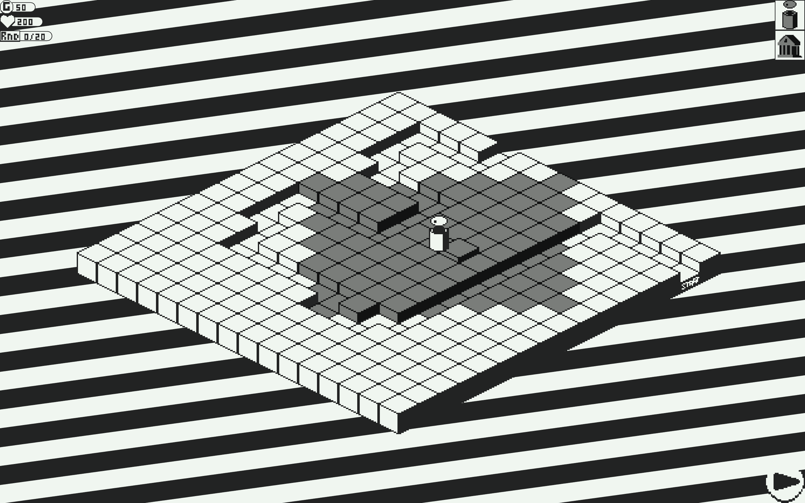

# twr-defns
An isometric tower defense game written in zig.

## Controls:
### Misc:
* F1 - Enable debug mode

### View:
* Middle mouse button - pan around
* Scroll wheel - zoom in and out

### Purchasing towers:
* Hover over a tower in the top right of the screen to view a tower's name, description and cost.
* Right click and drag a tower from the top right of the screen to a valid space on the board.

### Towers:
* Left click on a tower to view it's range.
* Right click on a tower to sell it for half it's cost.

### Advancing rounds
* If a round is not currently in progress click the play button in the bottom right to send the next wave of enemies.
